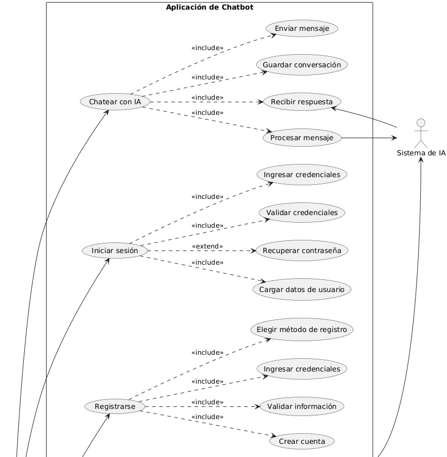
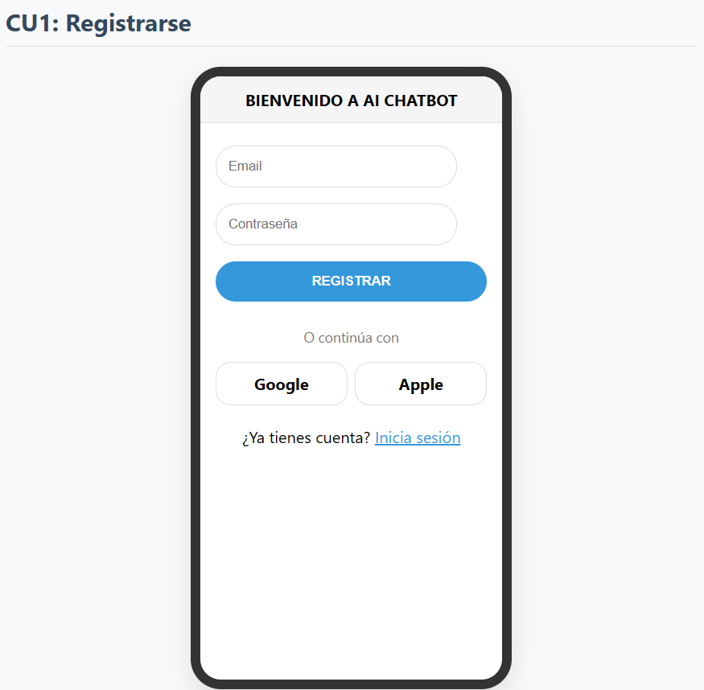
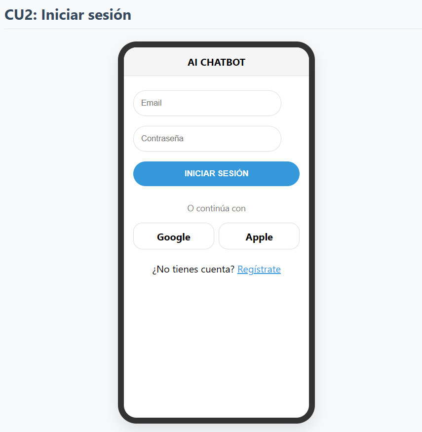
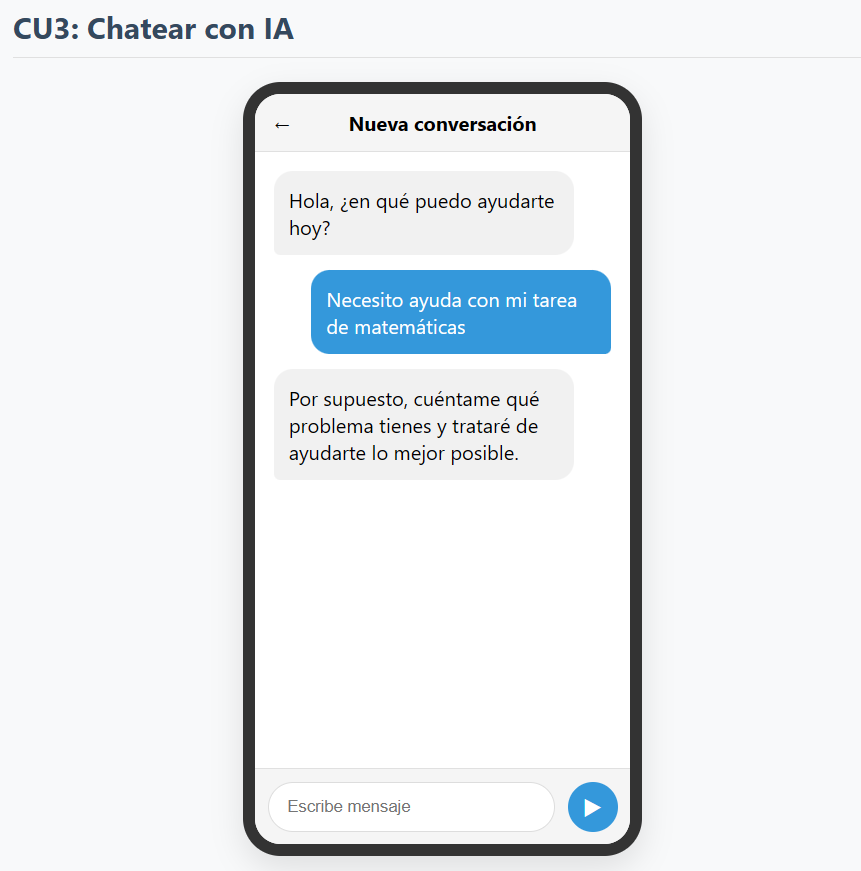
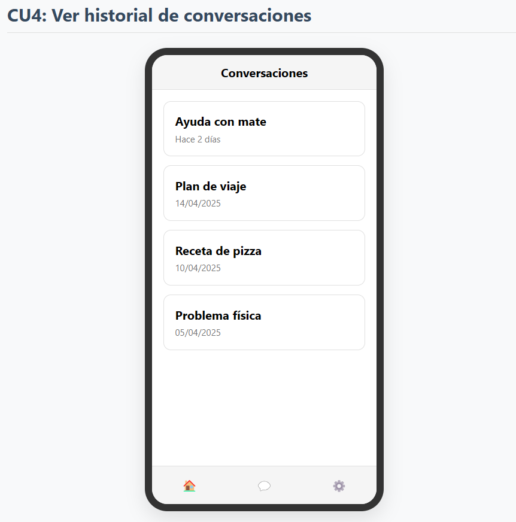
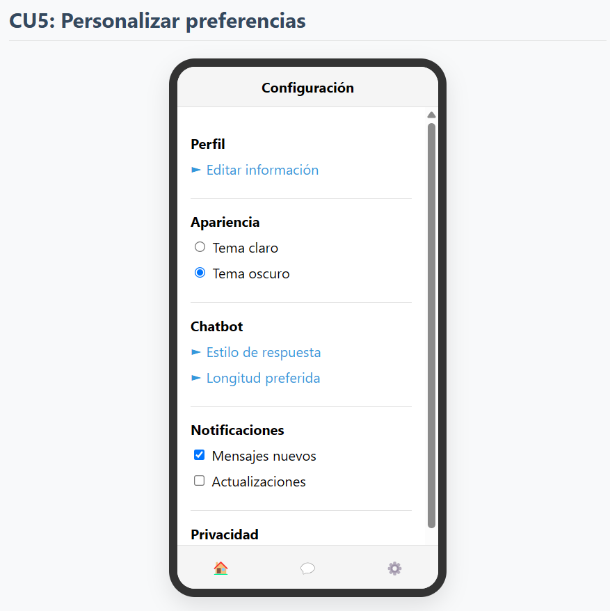
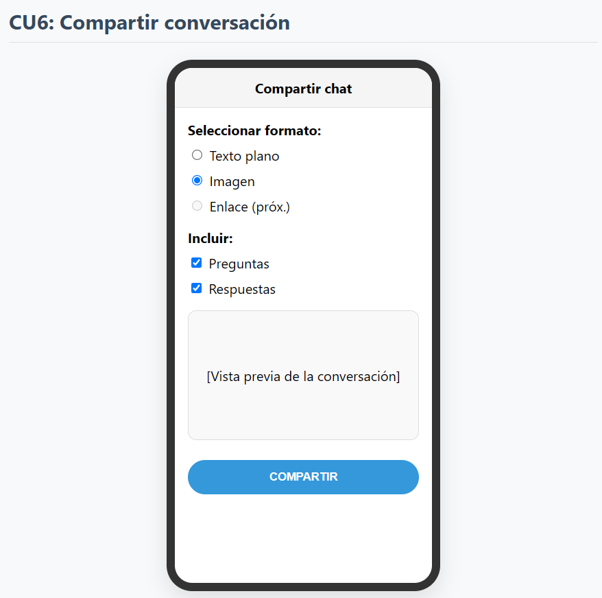
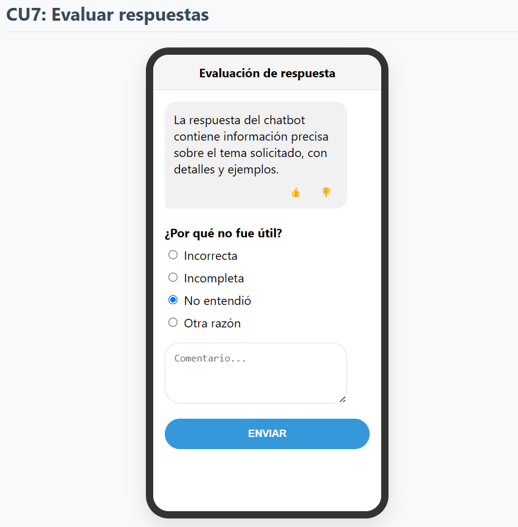
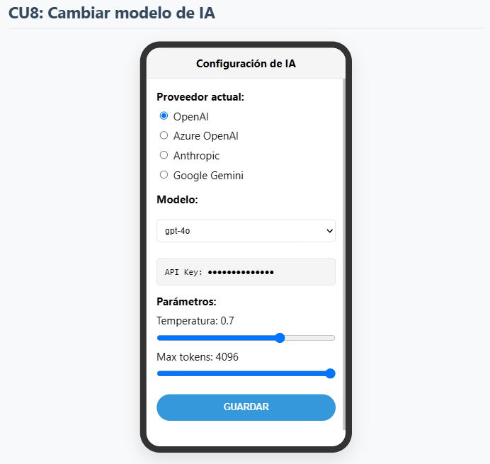
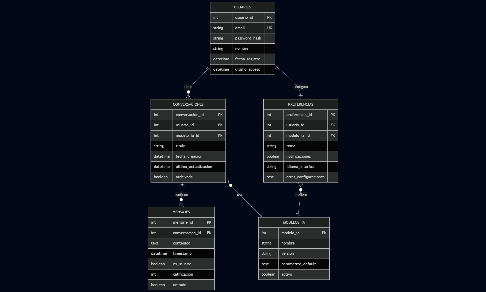

# Desarrollo de una Aplicación Móvil de Chatbot con AI

Este proyecto se centra en el desarrollo de una aplicación móvil de chatbot con inteligencia artificial, concebida como una plataforma interactiva donde los usuarios podrán comunicarse directamente con un modelo de IA. El sistema se basa en la interacción a través de una interfaz de chat intuitiva, procesando las entradas del usuario y generando respuestas en tiempo real. Desarrollada con Flutter para la parte cliente, que permite una experiencia nativa en múltiples plataformas, y un backend en Python desplegado en Azure, la aplicación inicia su funcionalidad integrando la API de OpenAI (ChatGPT), pero su diseño arquitectónico permite la flexibilidad para conectar con diferentes proveedores de modelos de IA en el futuro, asegurando adaptabilidad y escalabilidad.

## Índice de Contenido
1.  [Entorno de desarrollo](#1-entorno-de-desarrollo)
2.  [Diagrama de Despliegue](#2-diagrama-de-despliegue)
3.  [Requerimientos no Funcionales](#3-requerimientos-no-funcionales)
4.  [Diagrama de Casos de Uso](#4-diagrama-de-casos-de-uso)
5.  [Diagrama de Clases](#5-diagrama-de-clases)
6.  [Descripción de Casos de Uso (con Mockups)](#6-descripción-de-casos-de-uso-con-mockups)
7.  [Diagrama de Base de Datos](#7-diagrama-de-base-de-datos)

## 1. Entorno de desarrollo

El entorno de desarrollo para este proyecto de aplicación móvil de chatbot con IA se estructura en torno a tecnologías clave para cubrir tanto el cliente como el servidor y la integración con servicios externos. Los componentes principales son:

* **Frontend**: Se desarrollará utilizando **Flutter**, el SDK de UI de Google, conocido por su capacidad para construir aplicaciones compiladas nativamente para dispositivos móviles (iOS y Android), web y escritorio desde una única base de código **Dart**.
* **Backend**: Implementado en **Python**, aprovechando su ecosistema para tareas de servidor. Se emplearán frameworks web modernos como **FastAPI** o **Flask** para exponer una API RESTful que servirá como puente entre la aplicación móvil y los servicios de inteligencia artificial y base de datos centralizada.
* **Base de datos**: Para el almacenamiento local en el dispositivo móvil (como historial de conversaciones básicas o configuraciones), se utilizará **SQLite**. Para la persistencia de datos a nivel de backend en la nube (usuarios, configuraciones globales, logs, etc.), se empleará **Azure SQL Database**, como se detalla en el diagrama de despliegue.
* **Integración de IA**: La funcionalidad central de chatbot se basa en la interacción con una API de modelo de lenguaje. Inicialmente, se integrará la **API de OpenAI (ChatGPT)**, pero la arquitectura está diseñada para ser modular y permitir la futura incorporación o el cambio a otros proveedores de modelos de IA con el mínimo esfuerzo.
* **Despliegue**: Los servicios de infraestructura en la nube, incluyendo el hosting del backend, la base de datos centralizada y posiblemente otros servicios auxiliares (como monitoreo o gestión de API Gateway), se gestionarán en la plataforma **Microsoft Azure**.

Para comenzar a desarrollar en este proyecto, es necesario configurar el ambiente de desarrollo local instalando y configurando las siguientes herramientas. A continuación, se detalla su propósito y cómo realizar su instalación básica o dónde encontrar las guías oficiales:

* **Flutter SDK**:
    * **Descripción:** El kit de desarrollo fundamental para crear la interfaz de usuario y la lógica del lado del cliente. Incluye el compilador de Dart y las herramientas de línea de comandos (`flutter`) necesarias.
    * **Instalación:** Se recomienda encarecidamente seguir la documentación oficial de Flutter, ya que proporciona guías detalladas y específicas para cada sistema operativo (Windows, macOS, Linux):
        * Consulta la guía aquí: [Instalar Flutter](https://docs.flutter.dev/get-started/install)
    * Tras la instalación, ejecuta `flutter doctor` en la terminal para verificar que todos los componentes necesarios (SDK de Android, Xcode si estás en macOS, etc.) estén correctamente configurados.

* **Python**:
    * **Descripción:** El lenguaje de programación para el desarrollo del backend. Se utilizará para crear la API que se comunica con el frontend y la IA. Es recomendable usar una versión reciente, como Python 3.9 o superior.
    * **Instalación:** Descarga el instalador adecuado para tu sistema operativo desde el sitio web oficial de Python:
        * Descargar Python: [python.org/downloads](https://www.python.org/downloads/)
    * Es una práctica estándar y muy recomendada el uso de **entornos virtuales** para cada proyecto Python (`venv`, `virtualenv`, `conda`). Esto aísla las dependencias del proyecto y evita conflictos entre ellos. Puedes crear un entorno virtual básico con:
        ```bash
        python3 -m venv .venv
        ```
        Luego, actívalo (la forma varía según el SO y el shell):
        ```bash
        # En macOS/Linux:
        source .venv/bin/activate
        # En Windows (Cmd):
        .venv\Scripts\activate.bat
        # En Windows (PowerShell):
        .venv\Scripts\Activate.ps1
        ```
    * Una vez activado el entorno virtual, instala las librerías necesarias para el backend (como FastAPI, Uvicorn, requests, etc.) usando pip, generalmente especificadas en un archivo `requirements.txt`:
        ```bash
        pip install -r requirements.txt
        ```

* **IDE (Entorno de Desarrollo Integrado)**:
    * **Descripción:** Un editor de código con herramientas avanzadas para desarrollo. Los más recomendados para este proyecto son **Visual Studio Code (VS Code)** por su flexibilidad y soporte para múltiples lenguajes, o **Android Studio** (basado en IntelliJ IDEA) si prefieres un IDE más completo orientado específicamente a desarrollo móvil.
    * **Instalación:** Descarga e instala el IDE de tu elección:
        * [Visual Studio Code](https://code.visualstudio.com/)
        * [Android Studio](https://developer.android.com/studio)
    * Una vez instalado el IDE, busca e instala las extensiones o plugins necesarios para **Dart/Flutter** y **Python**. Estos plugins proporcionan resaltado de sintaxis, autocompletado, depuración y herramientas específicas del framework.

* **Git**:
    * **Descripción:** Un sistema de control de versiones distribuido esencial para el seguimiento de cambios en el código, la colaboración en equipo y la gestión del historial del proyecto.
    * **Instalación:** Git está disponible para todos los sistemas operativos principales. Descárgalo e instálalo desde el sitio oficial:
        * Descargar Git: [git-scm.com/downloads](https://git-scm.com/downloads)
    * Una vez instalado, podrás clonar el repositorio del proyecto para obtener una copia local del código fuente:
        ```bash
        git clone <URL_DEL_REPOSITORIO_AQUÍ>
        ```

* **Claves de API (OpenAI y otras)**:
    * **Descripción:** Credenciales necesarias para autenticarse y utilizar los servicios de terceros, como la API de OpenAI.
    * **Configuración:** Estas claves **no deben ser almacenadas directamente en el código fuente**. Deberán configurarse de forma segura en el entorno de ejecución del backend, típicamente mediante variables de entorno o un archivo de configuración cargado de forma segura. Consulta la documentación específica del backend del proyecto sobre cómo gestionar estas credenciales.


## 2. Diagrama de despliegue

La arquitectura a usar será una aplicación móvil desarrollada en Flutter y un backend en Python desplegado en Azure. La aplicación móvil utiliza SQLite local para el almacenamiento inmediato de datos de usuario y conversaciones, y accede al backend a través de un API Gateway en Azure App Service mediante solicitudes HTTPS, mientras que el backend persiste la información en Azure SQL Database, enruta las operaciones de lenguaje natural al Servicio de Lenguaje de Azure Cognitive Services o a la API de ChatGPT de OpenAI, y publica métricas y logs en Azure Monitor. Este modelo de la Figura 1 ilustra cómo los clientes interactúan con los distintos componentes y cómo se gestionan los datos y servicios en la nube.

<b>*Figura 1:*</b> Diagrama de Despliegue


## 3. Requerimientos no funcionales

1. **Rendimiento**:
   - Tiempo de respuesta máximo de 3 segundos para solicitudes al chatbot.
   - Capacidad para manejar al menos 100 usuarios concurrentes en fase de prototipo.

2. **Usabilidad**:
   - Interfaz intuitiva que no requiera tutorial para su uso básico.
   - Adaptabilidad a diferentes tamaños de pantalla (diseño responsive).
   - Soporte para modo oscuro y claro.

3. **Seguridad**:
   - Cifrado de datos en tránsito mediante HTTPS.
   - Almacenamiento seguro de credenciales de API.
   - Autenticación de usuarios mediante email/contraseña o proveedores OAuth.

4. **Disponibilidad**:
   - Disponibilidad del 99% durante fase de prototipo.
   - Mecanismo de caché para funcionar con conectividad limitada.

5. **Mantenibilidad**:
   - Código modular y documentado siguiendo estándares de Flutter y Python.
   - Pruebas unitarias con cobertura mínima del 70%.

6. **Escalabilidad**:
   - Arquitectura que permita cambiar entre diferentes proveedores de API de IA.
   - Capacidad para escalar horizontalmente en la nube.

7. **Compatibilidad**:
   - Soporte para Android 8.0+.
   - Funcionalidad offline básica cuando no haya conexión.

## 4. Diagrama de casos de uso

El siguiente diagrama de casos de uso representa las principales interacciones dentro de la Aplicación de Chatbot, basado en el modelo de requerimientos funcionales definido previamente. En este sistema, los usuarios pueden registrarse, iniciar sesión, chatear con el Sistema de IA, ver su historial de conversaciones, personalizar sus preferencias, compartir diálogos y evaluar la calidad de las respuestas recibidas. Por su parte, el Sistema de IA participa directamente en la generación de respuestas durante el caso de uso “Chatear con IA”, mientras que los administradores disponen de permisos adicionales para monitorear el uso de la plataforma, gestionar usuarios y cambiar el modelo de IA. Estas funcionalidades garantizan una experiencia interactiva, adaptable y fácilmente administrable dentro del prototipo móvil.

<b>*Figura 2:*</b> Diagrama de Casos de Uso




A continuación se detallan los casos de uso:

| ID   | Caso de Uso                         | Descripción                                                                                       |
|------|-------------------------------------|---------------------------------------------------------------------------------------------------|
| UC1  | Registrarse                         | Permite crear una cuenta en la aplicación proporcionando correo electrónico y contraseña.         |
| UC2  | Iniciar sesión                      | Permite autenticarse en la aplicación ingresando las credenciales de usuario registradas.         |
| UC3  | Chatear con IA                      | Permite enviar mensajes al Sistema de IA y recibir respuestas generadas en tiempo real.           |
| UC4  | Ver historial de conversaciones     | Permite consultar y navegar por las conversaciones previas almacenadas en la base de datos local. |
| UC5  | Personalizar preferencias           | Permite ajustar opciones de la aplicación como tema, notificaciones y configuración de modelo IA. |
| UC6  | Compartir conversación              | Permite exportar o enviar el contenido de una conversación a través de correo u otras aplicaciones.|
| UC7  | Evaluar respuestas                  | Permite calificar la calidad o relevancia de las respuestas proporcionadas por la IA.             |
| UC8 | Cambiar modelo de IA                | Permite al usuario seleccionar y configurar el proveedor o versión del modelo de IA.       |

Y el diagrama de clases es el siguiente:
## 5. Diagrama de Clases
<b>*Figura 3:*</b> Diagrama de Clases


## 6. Descripción de casos de uso (con mockups)

## CU1: Registrarse
**Actor principal**: Usuario  
**Descripción**: El usuario se registra en la aplicación proporcionando información básica.  
**Flujo principal**:
1. El usuario abre la aplicación por primera vez o selecciona "Registrarse"
2. El sistema muestra opciones de registro (email/contraseña, Google, Apple)
3. El usuario selecciona un método e ingresa la información requerida
4. El sistema valida la información y crea una cuenta
5. El sistema redirige al usuario a la pantalla principal

<b>*Figura 4:*</b> Mockup CU1


## CU2: Iniciar sesión
**Actor principal**: Usuario  
**Descripción**: El usuario accede a su cuenta existente.  
**Flujo principal**:
1. El usuario selecciona "Iniciar sesión"
2. El sistema muestra opciones de inicio de sesión
3. El usuario ingresa sus credenciales
4. El sistema valida las credenciales
5. El sistema carga los datos del usuario y muestra la pantalla principal

<b>*Figura 5:*</b> Mockup CU2  


## CU3: Chatear con IA
**Actor principal**: Usuario  
**Actores secundarios**: Sistema de IA (ChatGPT)  
**Descripción**: El usuario mantiene una conversación con el chatbot de IA.  
**Flujo principal**:
1. El usuario ingresa a la pantalla principal de chat
2. El usuario escribe y envía un mensaje
3. El sistema procesa el mensaje y lo envía a la API de OpenAI
4. La API de OpenAI genera una respuesta
5. El sistema muestra la respuesta en la interfaz de chat
6. El usuario puede continuar la conversación enviando más mensajes

**Flujo alternativo**:
- Si hay un error de conexión, se muestra un mensaje de error
- Si no hay conexión a internet, se utiliza la caché local para funcionalidades básicas

<b>*Figura 6:*</b> Mockup CU3


## CU4: Ver historial de conversaciones
**Actor principal**: Usuario  
**Descripción**: El usuario accede a sus conversaciones anteriores con el chatbot.  
**Flujo principal**:
1. El usuario selecciona "Historial" o "Conversaciones"
2. El sistema carga las conversaciones previas desde la base de datos local
3. El usuario puede seleccionar una conversación para continuarla
4. El sistema carga el contenido completo de la conversación seleccionada

<b>*Figura 7:*</b> Mockup CU4


## CU5: Personalizar preferencias
**Actor principal**: Usuario  
**Descripción**: El usuario configura las preferencias de la aplicación y del chatbot.  
**Flujo principal**:
1. El usuario selecciona "Configuración" o "Preferencias"
2. El sistema muestra opciones configurables
3. El usuario modifica preferencias (tema, notificaciones, comportamiento del chatbot)
4. El sistema guarda las preferencias en la base de datos local

**Mockup**:
<b>*Figura 8:*</b> Mockup CU5  


## CU6: Compartir conversación
**Actor principal**: Usuario  
**Descripción**: El usuario comparte fragmentos o conversaciones completas con otros.  
**Flujo principal**:
1. El usuario selecciona la opción "Compartir" en una conversación
2. El sistema muestra opciones de compartir (texto, imagen, enlace)
3. El usuario selecciona el método y el destinatario
4. El sistema genera el contenido en el formato elegido
5. El contenido se envía usando la aplicación seleccionada por el usuario

<b>*Figura 9:*</b> Mockup CU6 


## CU7: Evaluar respuestas
**Actor principal**: Usuario  
**Descripción**: El usuario proporciona feedback sobre las respuestas del chatbot.  
**Flujo principal**:
1. El sistema muestra opciones de evaluación junto a cada respuesta del chatbot
2. El usuario selecciona una evaluación (pulgar arriba/abajo, estrellas)
3. El sistema registra la evaluación y la envía al backend
4. Opcionalmente, se solicita más detalles sobre la evaluación

<b>*Figura 10:*</b> Mockup CU7  


## CU8: Cambiar modelo de IA
**Actor principal**: usuario  
**Descripción**: El usuario configura o cambia el proveedor del modelo de IA.  
**Flujo principal**:
1. El usuario accede a "Configuración de IA"
2. El sistema muestra las opciones de proveedores disponibles
3. El usuario selecciona un proveedor y configura parámetros (API keys, modelos)
4. El sistema valida la configuración y actualiza el servicio backend

<b>*Figura 11:*</b> Mockup CU8  


## 7. Diagrama de Base de Datos

El siguiente diagrama representa la estructura de la base de datos utilizada en la aplicación. Incluye las tablas principales para almacenar información de usuarios, conversaciones, preferencias y evaluaciones. Este diseño asegura un acceso eficiente y seguro a los datos necesarios para el funcionamiento del sistema.

<b>*Figura 11:*</b> Diagrama de Base de Datos

